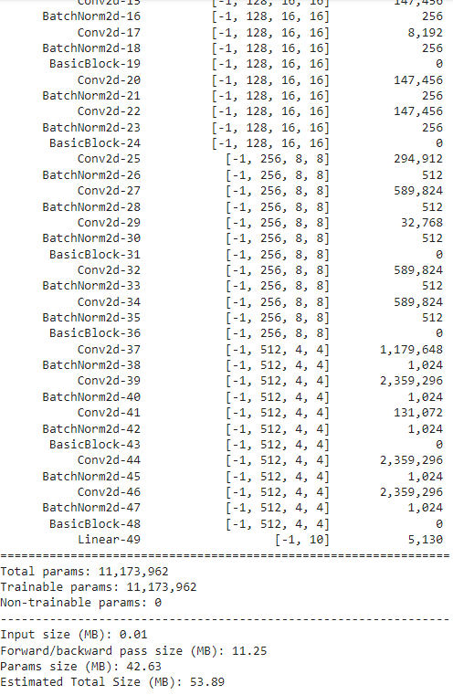
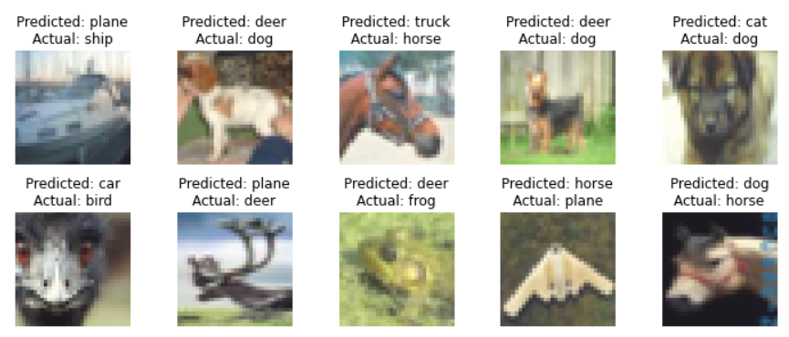
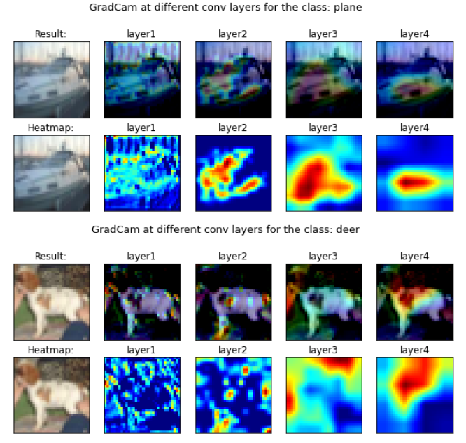

# ADVANCED TRAINING CONCEPTS

## Build the mentioned training structure. Train ResNet18 on Cifar10 for 20 Epochs.

**Aim**

- ✅ train resnet18 for 20 epochs on the CIFAR10 dataset
- ✅ show loss curves for test and train datasets
- ✅ show a gallery of 10 misclassified images
- ✅ show gradcam output on 10 misclassified images. 
- ✅ Apply these transforms while training:
         - RandomCrop(32, padding=4)
         - CutOut(16x16)


**File Structure**

- ✅ models folder - Contains resnet.py file, which has only have ResNet 18/34 models. 
- ✅ main.py - this is the file that we have imported (along with the model). This main file is able to take these params or we are able to pull functions from it and then perform operations, like:
         - training and test loops
         - data split between test and train
         - epochs
         - batch size
         - which optimizer to run
         - do we run a scheduler?
- ✅ utils.py file - this is where we have all of our utilities like:
        - image transforms,
        - gradcam,
        - misclassification code,
        - tensorboard related stuff
        - advanced training policies, etc

# Results

## Model Summary


## Training Log

```
Epoch 1
Loss=1.8024873733520508 Batch_id=390 Train Accuracy=37.73: 100%|██████████| 391/391 [02:16<00:00,  2.87it/s]

Test set: Average loss: 1.4976, Test Accuracy: 4671/10000 (46.71%)

Epoch 2
Loss=1.3606120347976685 Batch_id=390 Train Accuracy=49.19: 100%|██████████| 391/391 [02:17<00:00,  2.84it/s]

Test set: Average loss: 1.1067, Test Accuracy: 6059/10000 (60.59%)

Epoch 3
Loss=1.4138081073760986 Batch_id=390 Train Accuracy=54.67: 100%|██████████| 391/391 [02:16<00:00,  2.86it/s]

Test set: Average loss: 1.0775, Test Accuracy: 6309/10000 (63.09%)

Epoch 4
Loss=1.0150809288024902 Batch_id=390 Train Accuracy=59.79: 100%|██████████| 391/391 [02:18<00:00,  2.82it/s]

Test set: Average loss: 1.0177, Test Accuracy: 6485/10000 (64.85%)

Epoch 5
Loss=0.9737280011177063 Batch_id=390 Train Accuracy=62.42: 100%|██████████| 391/391 [02:17<00:00,  2.84it/s]

Test set: Average loss: 0.8015, Test Accuracy: 7160/10000 (71.60%)

Epoch 6
Loss=1.1444149017333984 Batch_id=390 Train Accuracy=64.90: 100%|██████████| 391/391 [02:18<00:00,  2.81it/s]

Test set: Average loss: 0.7334, Test Accuracy: 7509/10000 (75.09%)

Epoch 7
Loss=0.862195611000061 Batch_id=390 Train Accuracy=67.10: 100%|██████████| 391/391 [02:17<00:00,  2.84it/s]

Test set: Average loss: 0.7121, Test Accuracy: 7602/10000 (76.02%)

Epoch 8
Loss=0.7897188067436218 Batch_id=390 Train Accuracy=68.69: 100%|██████████| 391/391 [02:18<00:00,  2.81it/s]

Test set: Average loss: 0.6242, Test Accuracy: 7853/10000 (78.53%)

Epoch 9
Loss=0.9160833358764648 Batch_id=390 Train Accuracy=70.09: 100%|██████████| 391/391 [02:17<00:00,  2.84it/s]

Test set: Average loss: 0.6283, Test Accuracy: 7886/10000 (78.86%)

Epoch 10
Loss=0.7009462714195251 Batch_id=390 Train Accuracy=71.16: 100%|██████████| 391/391 [02:18<00:00,  2.82it/s]

Test set: Average loss: 0.5624, Test Accuracy: 8134/10000 (81.34%)

Epoch 11
Loss=0.6723220348358154 Batch_id=390 Train Accuracy=72.53: 100%|██████████| 391/391 [02:17<00:00,  2.84it/s]

Test set: Average loss: 0.7402, Test Accuracy: 7622/10000 (76.22%)

Epoch 12
Loss=0.8994243741035461 Batch_id=390 Train Accuracy=73.57: 100%|██████████| 391/391 [02:18<00:00,  2.81it/s]

Test set: Average loss: 0.5478, Test Accuracy: 8195/10000 (81.95%)

Epoch 13
Loss=0.8111507296562195 Batch_id=390 Train Accuracy=74.19: 100%|██████████| 391/391 [02:17<00:00,  2.84it/s]

Test set: Average loss: 0.4974, Test Accuracy: 8280/10000 (82.80%)

Epoch 14
Loss=0.8665165901184082 Batch_id=390 Train Accuracy=74.88: 100%|██████████| 391/391 [02:18<00:00,  2.82it/s]

Test set: Average loss: 0.4853, Test Accuracy: 8373/10000 (83.73%)

Epoch 15
Loss=0.6989811658859253 Batch_id=390 Train Accuracy=75.45: 100%|██████████| 391/391 [02:17<00:00,  2.84it/s]

Test set: Average loss: 0.4581, Test Accuracy: 8514/10000 (85.14%)

Epoch 16
Loss=0.961521327495575 Batch_id=390 Train Accuracy=76.62: 100%|██████████| 391/391 [02:18<00:00,  2.81it/s]

Test set: Average loss: 0.4549, Test Accuracy: 8445/10000 (84.45%)

Epoch 17
Loss=0.5958508253097534 Batch_id=390 Train Accuracy=76.66: 100%|██████████| 391/391 [02:17<00:00,  2.84it/s]

Test set: Average loss: 0.4676, Test Accuracy: 8465/10000 (84.65%)

Epoch 18
Loss=0.6554961204528809 Batch_id=390 Train Accuracy=77.36: 100%|██████████| 391/391 [02:19<00:00,  2.81it/s]

Test set: Average loss: 0.4495, Test Accuracy: 8460/10000 (84.60%)

Epoch 19
Loss=0.3812870383262634 Batch_id=390 Train Accuracy=78.27: 100%|██████████| 391/391 [02:17<00:00,  2.84it/s]

Test set: Average loss: 0.4370, Test Accuracy: 8565/10000 (85.65%)

Epoch 20
Loss=0.6162017583847046 Batch_id=390 Train Accuracy=78.87: 100%|██████████| 391/391 [02:19<00:00,  2.81it/s]

Test set: Average loss: 0.4252, Test Accuracy: 8615/10000 (86.15%)
```


## Misclassified Images
10 missclassified images in the test set:          


## Grad-CAM outputs
10 grad-cam outputs for misclasified images in the test set:               


# Group members
Nishant Bhansali

Ruchika Agrawal


